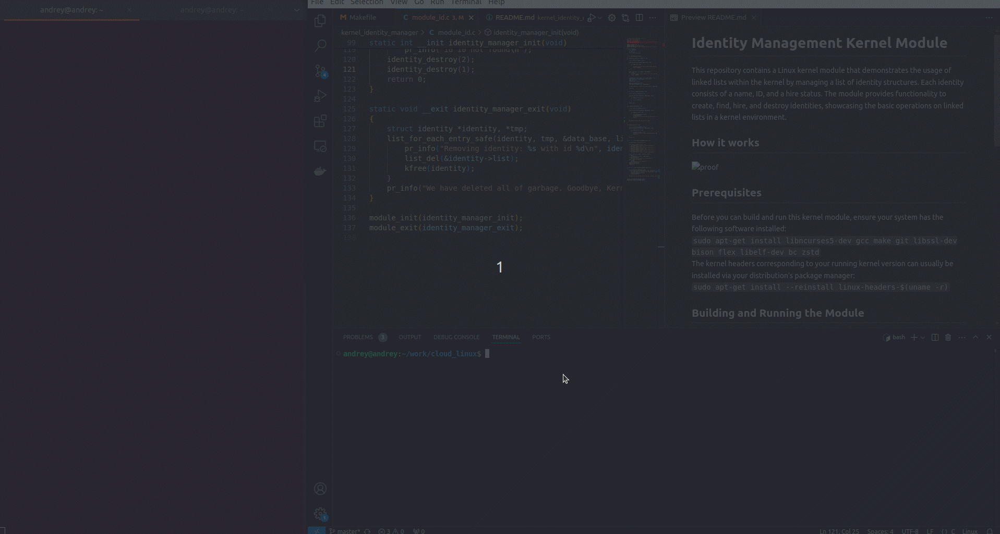

# Identity Management Kernel Module

This repository contains a Linux kernel module that demonstrates the usage of linked lists within the kernel by managing a list of identity structures. Each identity consists of a name, ID, and a hire status. The module provides functionality to create, find, hire, and destroy identities, showcasing the basic operations on linked lists in a kernel environment.

## How it works

## Prerequisites
Before you can build and run this kernel module, ensure your system has the following software installed:
 `sudo apt-get install libncurses5-dev gcc make git libssl-dev bison flex libelf-dev bc zstd`
 The kernel headers corresponding to your running kernel version can usually be installed via your distribution's package manager:
 `sudo apt-get install --reinstall linux-headers-$(uname -r)`

## Building and Running the Module
To build the module, use the provided Makefile with the following commands from the root directory of the project:
 `make all` # Compile the module
 `sudo make load` # Load the module into the kernel
 `sudo make unload` # Remove the module from the kernel
 `make clean` # Remove generated files
Module Functionality

Once the module is loaded, it will automatically create several identities, find and hire them, and then demonstrate the removal of identities. The module's behavior is logged through kernel messages, which can be viewed using dmesg.

## License
This project is licensed under the GPL v2 license, as indicated by the module source file headers.